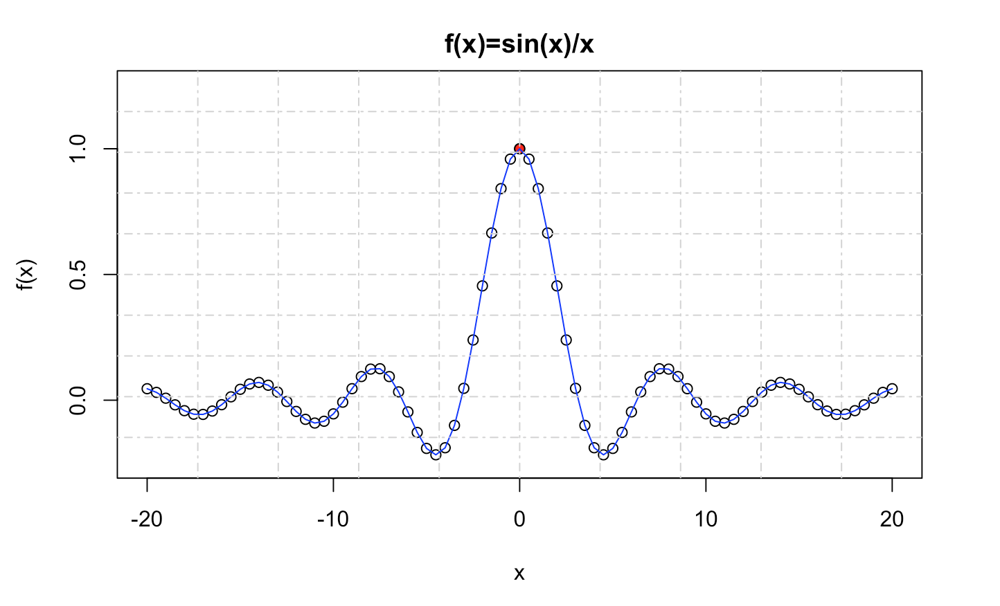

```{r setup, include=FALSE}
knitr::opts_chunk$set(echo = TRUE)
```

**************************************************************

# Generación de Guión de Ejercicios 

Compila este documento en formato HTML y genera el documento de los ejercicios (todavía sin completar) de la sesión de Introducción al Lenguaje R. 

```{r}

```

**************************************************************

# Graphics 

```{r}
x <- seq(from=-2*pi,to=2*pi,by=pi/20) #vector
y <- sin(x) #vector
plot(x,y) #graphic
```

```{r}
M <- cbind(x,y) #matrix
plot(M) #same graphic
```

```{r}
plot(x,y,xlab="X",ylab="Y",
     main="sin(x) graphic",
     cex.main=2,cex.lab=1.5,
     pch=21,col=1,bg=(x>0),
     cex=abs(y))
```

*Importante: Las funciones que modifican una figura (plot) creada previamente se deben ejecutar conjuntamente. Así, es necesario lanzar el Chunk de código completo.*

```{r}
plot(x,y,xlab="x value",ylab="y value",
     main="sin(x) function",
     cex.main=2,cex.lab=1.5,
     pch=21,col=1,bg=(x>0),
     cex=abs(y))
grid(nx=10,ny=10,lty=4) 
abline(h=0,col="red",lty=2)
abline(v=0,col="blue",lty=2)
points(x =-3*pi/2 ,y=sin(-3*pi/2),pch="*",col="red",cex=3)
text(x =-3*pi/2+2 ,y=sin(-3*pi/2),labels="max(sin(x))",col="red")
mtext("<<Texto en el Margen>>", side = 4)
```

Dada la función $f(x)=\frac{sin(x)}{x}$:

* Genera la gráfica cuando $x\in[-20,20]$ en incrementos de $\Delta x=0.5$ fijando los límites de $f(x)\in[-0.25,1,25]$
* Sustituye el valor `NaN` de `f(x)` por el valor 1 y represéntalo con un círculo relleno de rojo. 
* Añade una línea azul que una los puntos. 
* Añade rejilla, título, etc. 

Insertamos en el makrdown una figura ilustrativa de lo que hay que generar:   
   

```{r}
#solución:
x <- seq(from=-20, to=20, by=0.5);
y <- sin(x)/x;
plot(x,y, ylab="f(x)", xlab = "x", ylim = c(-0.25,1.25), type = "o", main = "f(x)=sin(x)/x");
points(x=0,y = 1, pch = 20, col="red");
grid(nx = 10, ny = 10);
lines(x,y,col="blue")

```

**************************************************************

# Factor

## Create Factor

### Unordered

```{r}
sex.v <- c('M', 'F', 'F', 'M', 'M', 'F')
sex.f <- factor(sex.v) # unordered
sex.w <- as.character(sex.f) # restore
```

### Ordered 

```{r}
size.v <- c('S', 'L', 'M', 'L', 'S', 'M')
size.f <- factor(size.v, ordered=TRUE)
# ordered L < M < S from underlying type
```

### Ordered, where we set the order

```{r}
size.lvls <- c('S', 'M', 'L') # set order
size.f <- factor(size.v, levels=size.lvls, ordered=TRUE)
# above: ordered (low to high) by levels
```


### Ordered with levels and labels

```{r}
levels <- c(1, 2, 3, 99) # from codesheet
labels <- c('Love','Neutral','Hate',NA)
data.v <- c(1, 2, 3, 99, 1, 2, 1, 2, 99)
data.f <- factor(data.v, levels=levels)
data.f <- factor(data.v, levels=levels,labels=labels)
# levels: input - how factor() reads in
# labels: output - how factor() puts out
# Note: if specified, labels become the internal reference and coding frame
```

## Managing Factors

### Get Levels

```{r}
f <- factor(c("a","b","c")) # example data
levels(f) # -> get all levels
levels(f)[1] # -> get a specific level
```

Get get all levels of `s` factor. 

* Rename the factors so that they start with a capital letter.
* Test existence of a level "Divorced". 
* Add the level "Divorced"
* Modify second element to "Divorced".

```{r}
s <- factor(c("single", "married", "married", "single"));
s
#solution
any(levels(s)=="Divorced")
levels(s) = c("Single", "Married", "Divorced")
s[2] <- "Divorced"
s
```

Use the `cut` function to create the `age` ordered factor with 3 levels from `v` vector.

* Change de levels to "young" < "adult" < "older". 
* Select the values of `v` that match `age` less than "older".

```{r}
v<-c(40L, 35L, 69L, 74L, 38L, 58L, 13L, 27L, 17L, 68L, 21L, 80L, 
42L, 19L, 29L, 52L, 65L, 40L, 80L, 23L, 59L, 78L, 37L, 38L, 76L, 
75L, 3L, 22L, 29L, 29L)

#solution
cutValues <- cut(v, 3, ordered_result = TRUE, labels = c("young","adult","older"))
cutValues

```


## Plot Factors

```{r}
v<-c("L", "M", "M", "L", "M", "L", "M", "L", "L", "L", "M", "M", 
"L", "M", "S", "L", "M", "S", "M", "L", "M", "L", "S", "S", "M", 
"L", "L", "M", "M", "M")
plot(factor(v)) # unordered
plot(factor(v, levels=c('S', 'M', 'L'), ordered=TRUE)) #ordered
```

Modifica el gráfico anterior obtenido del factor(v) para obtener el siguiente resultado. 

```{r}
#solución: 
plot(factor(v, levels=c('S', 'M', 'L'), ordered=TRUE),
     col = c("red", "blue", "green"),ylim = c(0,20), plot = TRUE) #ordered
grid(nx = 0, ny = 9, lty = 1, col = "gray")
# La suma del 0.05 es para que el borde no lo tape
abline(h = length(v[v == "S"]) + 0.1, lty = 5, col = "red", lwd = 2)
abline(h = length(v[v == "M"]) + 0.1, lty = 5, col = "blue", lwd = 2)
abline(h = length(v[v == "L"]) + 0.1, lty = 5, col = "green", lwd = 2)
```

**************************************************************

# List

## Lists Creation

```{r}
l1 <- list('cat', 5, 1:10, FALSE) # unnamed 
l2 <- list(x='dog', y=5+2i, z=3:8) # named 
l3 <- c(l1, l2) # one list partially named 
l4 <- list(l1, l2) # a list of 2 lists
```

## Indexing examples

```{r}
j <- list(a='cat', b=5, c=FALSE)
x1 <- j$a # puts 1-item char vec 'cat' in x
x2 <- j[['a']] # much the same as above
x3 <- j['a'] # puts 1-item list 'cat' in x
x4 <- j[[1]] # 1-item char vec 'cat' in x
x5 <- j[1] # puts 1-item list 'cat' in x
```

Dada la lista `l` dada: 

* Añade el vector "n" en la sexta posición de la lista. 
* ¿Qué ha pasado con el quinto elemento de la lista? 
* Añade el vector "w" en el elemento "k" de la lista. 
* Cambia el contenido del la posición "w" al valor "e"

```{r}
l <- list(x='a', y='b', z='c', t='d')
n <- c("odio","el","programa","r")

#solucion 
l[6] <- n
l["k"]<- "w"
l["w"]<-"e"
#♠ El valor 5 lo añade como nulo

```

The `vocals` list has a sample of the vowels of different supports:
* How many items does the list have? 
* Which item is longer? uses the `str` instruction to get information about its content. 
* Turn the `notebook` item into the `f.notebook` factor and plot it.

```{r}
vocals<-list(story = c("e", "e", "e", "e", "a", "e", "o", 
"o", "o", "a"), poetry = c("e", "e", "i", "e", "e"), book = c("e", 
"e", "e", "o", "e", "o", "u", "o", "e", "e", "a", "i", "a", "u", 
"e", "a", "o", "u", "e", "e", "a", "e", "a", "o", "e", "a", "a", 
"e", "o", "e", "u", "o", "u", "a", "o", "u", "i", "a", "a", "u", 
"a", "a", "e", "u", "a", "e", "a", "e", "a", "a"), notebook = c("a", 
"o", "e", "e", "e", "a", "a", "i", "e", "a", "u", "e", "e", "i", 
"a", "e", "e", "o", "e", "e"), booklet = c("e", "e", "o", "i", 
"i", "o", "a", "i", "i", "a", "i", "e", "i", "o", "a", "a", "o", 
"o", "o", "e", "o", "a", "o", "i", "o", "e", "e", "i", "a", "u"
))

# solution
str(vocals)
#Tiene 5 elementos la lista y la más grande es book que tiene 50
f.notebook <- vocals["notebook"]
f.notebook

```

Create a `hotel` list containing information about people. Enter the name, surname and age of the following actors:
* Rachel Weisz, age= 48
* Gerard Butler age=48

```{r}
hotel<-list()

#solution
listRachel <- list();
listRachel["name"]="Rachel";
listRachel["surname"]="Wisz";
listRachel["age"]="48";

listGerard <- list();
listGerard["name"]<-"Gerard";
listGerard["surname"]<-"Butler";
listGerard["age"]<-"48";
hotel <- list(listRachel,listGerard)
hotel

```

**************************************************************

# Generación de Guión de Ejercicios Completos  

Compila este documento en formato HTML y genera el documento de los ejercicios (¡ahora completados!) de la sesión de Introducción al Lenguaje R.

```{r}

```